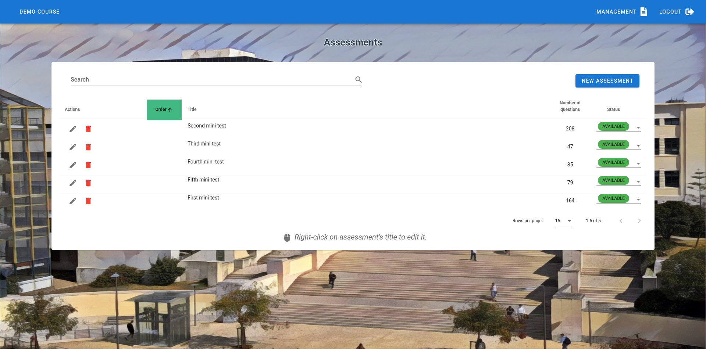
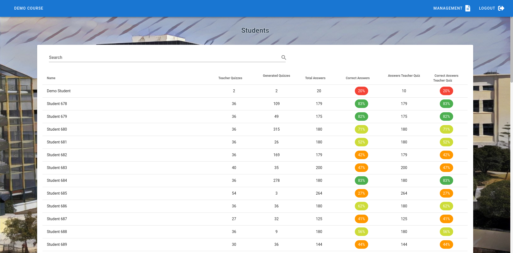
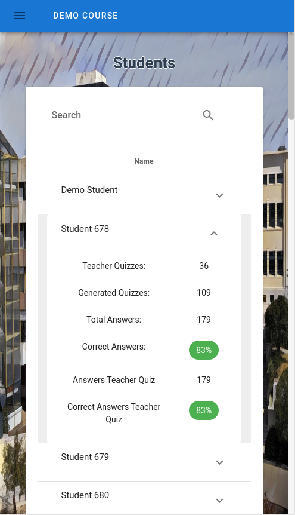
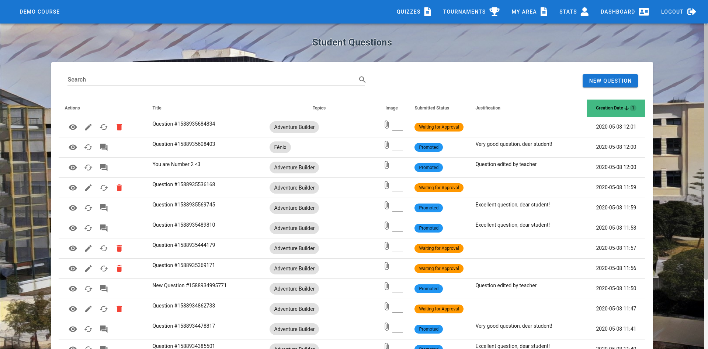
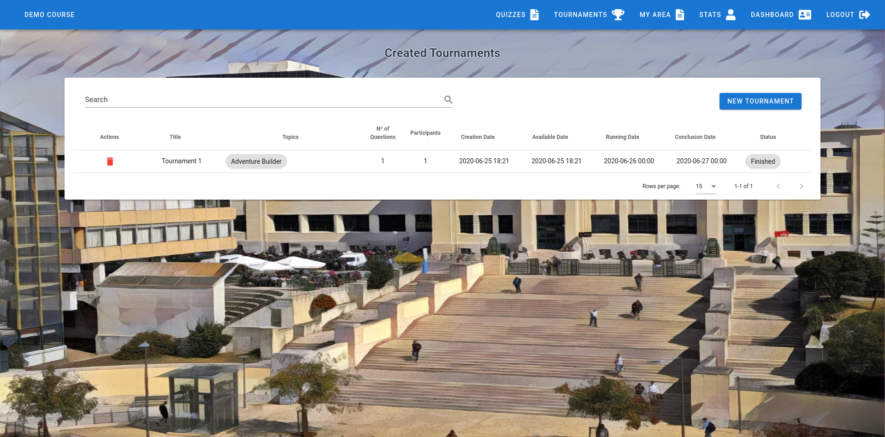
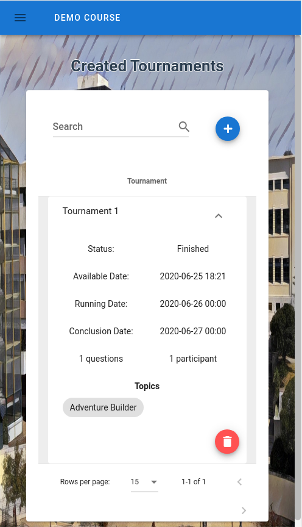
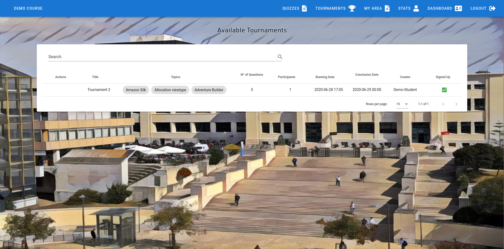
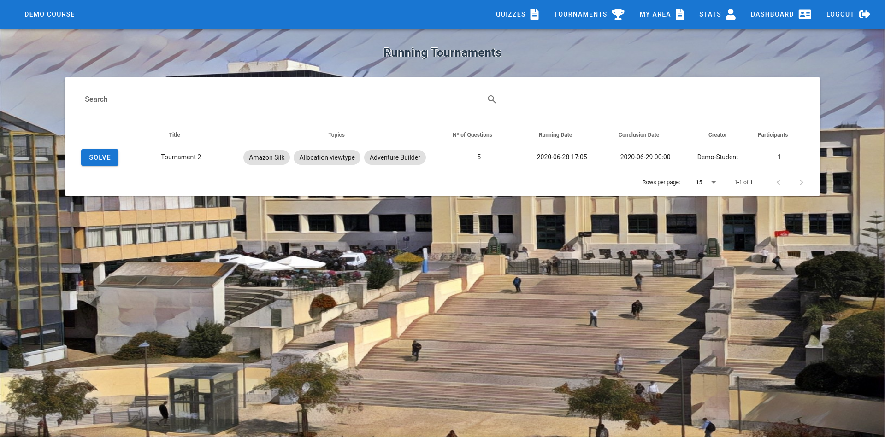
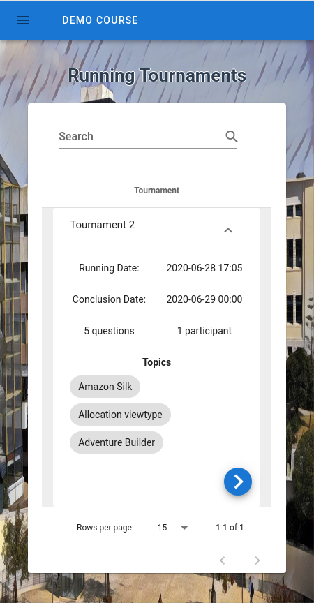
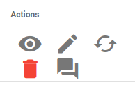

# ES20 final submission, Group 19

## Feature UI

### Mobile Responsiveness

#### Subgroup
Afonso Gonçalves & Mariana Oliveira

#### Description
Refactor the application presentation, so it is more usable in smaller screens. We managed to have no information loss in this refactor.

#### Screenshots

**Teacher Questions**

Desktop                              |  Mobile
:-----------------------------------:|:-----------------------------------:
 | 

**Teacher Quizzes**

Desktop                              |  Mobile
:-----------------------------------:|:-----------------------------------:
 | 

**Teacher Assessments**

Desktop                              |  Mobile
:-----------------------------------:|:-----------------------------------:
 | 

**Teacher Students**

Desktop                              |  Mobile
:-----------------------------------:|:-----------------------------------:
 | 

**Teacher Topics**

Desktop                              |  Mobile
:-----------------------------------:|:-----------------------------------:
 | 

**Student Student Questions**

Desktop                              |  Mobile
:-----------------------------------:|:-----------------------------------:
 | 

**Student Created Tournaments**

Desktop                              |  Mobile
:-----------------------------------:|:-----------------------------------:
 | 

**Student Available Tournaments**

Desktop                              |  Mobile
:-----------------------------------:|:-----------------------------------:
 | 

**Student Running Tournaments**

Desktop                              |  Mobile
:-----------------------------------:|:-----------------------------------:
 | 

### Mathematical writing

#### Subgroup
Daniel Seara

#### Description
Allow teachers and students to create questions and insert mathematical formulas, using CKEditor4 and Latex

#### Screenshots

  

### Interface Consistency

#### Subgroup
Daniel Seara

#### Description
Normalize the size of all the action buttons and the color of the Save/Cancel buttons.

#### Screenshots

**Cancel/Save buttons**

Before                               |  After
:-----------------------------------:|:-----------------------------------:
 | 

**Action buttons**

Before                               |  After
:-----------------------------------:|:-----------------------------------:
 | 

## Conclusion of Tournament Feature

### Solved Tournaments

#### Subgroup
Lourenço Duarte & Marcelo Santos

#### Description
Allow students to see the tournaments that they have participated

#### Screenshots

## Deployment
The application was deployed in the [Google Cloud Platform](https://cloud.google.com/). Since this application was completely designed for the cloud, with a backend that requires persisting data to the filesystem, and that is slow to start (~20s), we were not locked in to any particular solution from the start. Only two requirements were easy to identify: support from instantiating Virtual Machines, and providing a managed PostgresSQL database, both of which are available in most players. In the end GCP was chosen for three distinguishing reasons: official support for mounting storage buckets in the filesystem for persistency without much lock-in, Google's experience in computing with Linux and containers at scale and [Terraform](https://www.terraform.io/) integration.

The biggest factor conditioning our choice would be money, but without actually starting to operate there is no data to support that decision, so the only option is to just pick whatever seems best at the time, and abstracting away cloud-specific features to be able to migrate in the future with minimal effort. Additionally, pricing is often negotiated on a per-customer basis, so a cloud that looks a little bit more expensive today may be the cheaper option after a few months of usage and negotiation.

Both the backend and frontend were already prepackaged as containers, so they were deployed as such. In order to inject secrets and mount storage buckets, the original images are adapted into GCP-specialized ones, which are uploaded to Google Container Registry and later deployed.

The frontend, being just a simple webserver with near-instant startup time and no dependencies, was deployed with Cloud Run, which can run containers directly and auto scale them based on load.

The backend, taking into account the slow startup and bucket mount requirements, was deployed as a VM instance group, which can also be scaled up and down based on load, behind a Load Balancer. The backend can reach the internet, but not the other way round in its private network. Note that these VMs only pull and start the backend container on boot: they have no special configuration besides that.

The database is Google's managed solution for PostgreSQL, and can only be reached by the backend through its private network.

We do rely on Google to manage and expose application secrets to our containers.

Any other persistent state (user assets, imports, exports) are stored in storage buckets, which are mounted in the containers before the backend application starts.

All infrastructure is declared and managed with [Terraform](https://www.terraform.io/) and stored in the repo: rolling back changes is as simple as using git and letting CI/CD processes do their job. Tests and container builds are run in GitHub Actions, but Terraform infrastructure modification is handled by an [Atlantis](https://www.runatlantis.io/) instance that is also running on GCP (and also managed by our Terraform configuration). The pull request workflow directly integrates deployment as seen [here](https://github.com/tecnico-softeng/es20al_19-project/pull/379).

This solution has the big advantage of keeping operations joined in the codebase, and keeping developers in the loop about deployment. Staging environments also become trivial to create when all the infrastructure is described as code and is ready to apply in any GCP project (including our own). The biggest drawback so far is the lack of branch-conditioned actions support in Atlantis (it's already possible with some configuration, but the experience could be a lot better. See [their issue about it](https://github.com/runatlantis/atlantis/issues/982)).

